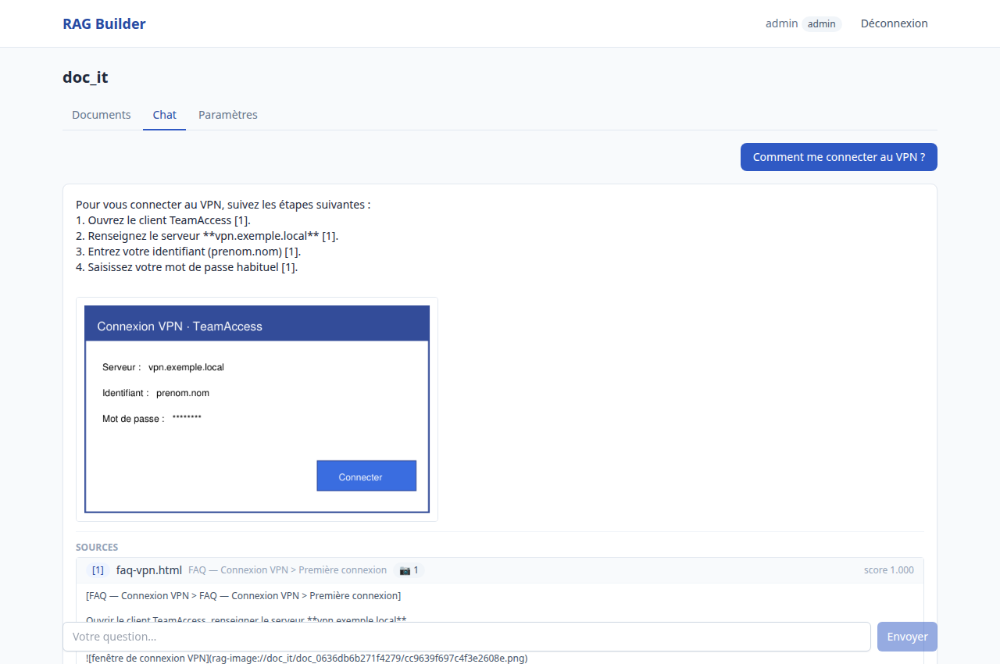
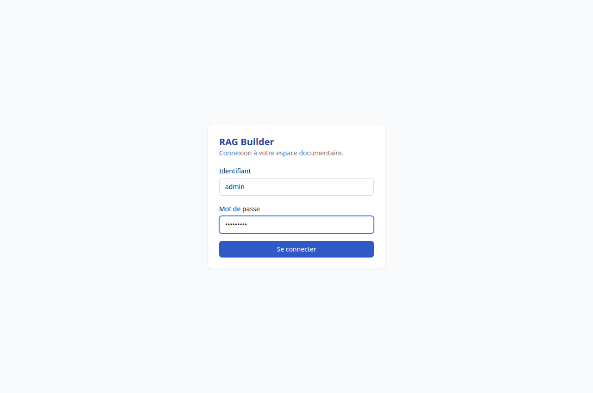
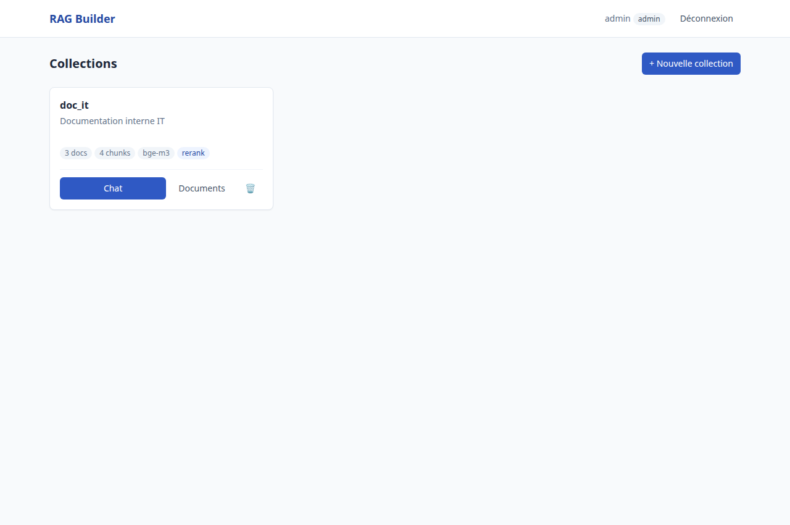
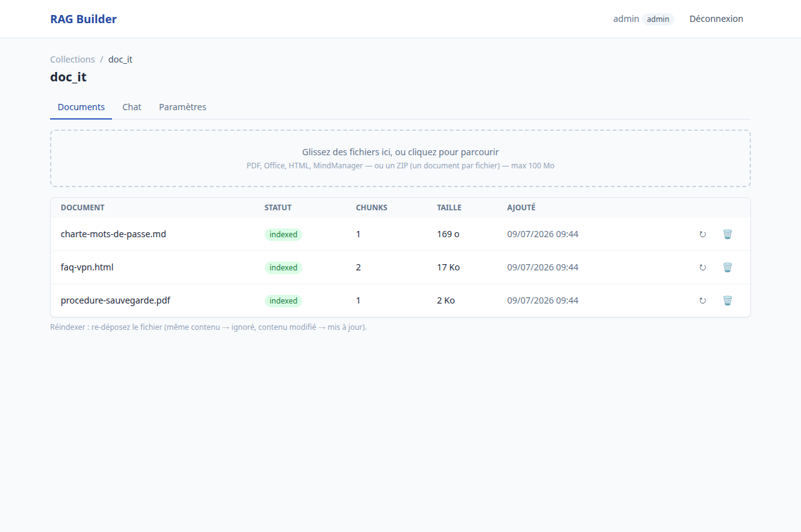
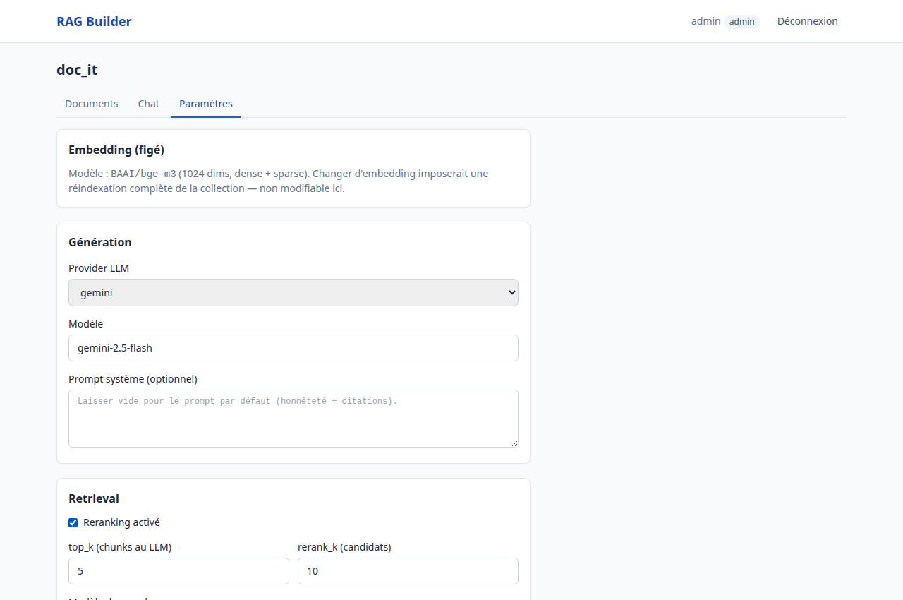

# RAG Builder

Plateforme de **RAG multi-collections** auto-hébergée : créez une collection, déposez vos
documents (PDF, HTML, Office, ZIP…), et interrogez-les en chat — réponse **streamée**,
**sources citées** cliquables, **captures d'écran affichées** dans la réponse. Ajoutez ou
retirez des documents à tout moment, sans réindexer le reste.



## Points clés

- **Indexation 100 % locale** : embeddings `BAAI/bge-m3` (dense + lexical) et reranking
  sur CPU — aucun document n'est envoyé à un service externe pour l'indexation.
- **Recherche hybride** (sémantique + mots-clés exacts) via Qdrant, fusion RRF native.
- **Réponses honnêtes** : le modèle répond uniquement à partir des extraits retrouvés,
  cite ses sources `[n]`, et dit explicitement quand l'information n'est pas dans la base.
- **Images comprises** : les captures d'écran des documents sont extraites, décrites
  (recherchables !) et affichées dans les réponses — y compris celles hébergées par un
  GLPI interne (rapatriement authentifié optionnel).
- **Multi-provider** pour la génération : Mistral (défaut, hébergé UE), Gemini, Anthropic,
  ou Ollama (100 % local).
- **Multi-utilisateurs** : comptes locaux, rôles admin/utilisateur, feedback 👍/👎.

## Démarrage rapide (poste de travail, sans Docker)

Prérequis : Python 3.11+, ~5 Go de disque pour les modèles locaux.
Optionnels : `soffice` (LibreOffice) pour les vieux formats Office, `ocrmypdf` +
`tesseract-ocr-fra` pour l'OCR des PDF scannés.

```bash
git clone https://github.com/Titouanos/RAG-DATA.git && cd RAG-DATA
python3 -m venv .venv && . .venv/bin/activate
pip install -e ".[gemini,mistral,api,dev]"

# 1) Télécharger le modèle d'embedding (une seule fois ; le reranker se télécharge
#    automatiquement au premier démarrage, puis tout est en cache local)
export HF_HOME="$PWD/storage/models_cache"
python -c "from huggingface_hub import snapshot_download as d; \
  d('BAAI/bge-m3', ignore_patterns=['*.onnx','onnx/*'])"

# 2) Configurer
cp .env.example .env        # renseigner au minimum la clé du provider LLM choisi

# 3) Créer le premier compte administrateur
python -m rag_builder create-user admin --admin

# 4) Lancer
python -m rag_builder serve --port 8000
```

Ouvrez **http://127.0.0.1:8000** et connectez-vous.



## Guide d'utilisation

### 1. Créer une collection

Une collection = une base documentaire indépendante (par équipe, par sujet…), avec ses
propres réglages. Le modèle d'embedding est figé à la création (en changer imposerait de
réindexer).



### 2. Déposer des documents

Glissez-déposez vos fichiers — ou **un ZIP entier** (un export de base de connaissances en
HTML, par exemple) : chaque fichier supporté devient un document individuel, citable et
supprimable. La progression de l'indexation s'affiche en temps réel ; re-déposer un
fichier inchangé est ignoré, un fichier modifié est mis à jour.

Formats : PDF, `.docx/.pptx/.xlsx`, HTML, Markdown, texte/CSV, MindManager `.mmap`,
vieux Office `.doc/.xls/.ppt` (via LibreOffice), archives ZIP. Les PDF scannés sont
détectés et l'OCR peut être activé par collection (Paramètres).



### 3. Poser des questions

Réponse token par token, citations `[n]`, panneau **Sources** avec extraits dépliables,
scores et vignettes des captures (badge 📷). Les images pertinentes s'affichent
directement dans la réponse. Si l'information n'est pas dans la base, le système le dit —
il n'invente pas.

### 4. Régler la collection

Provider/modèle de génération, nombre d'extraits, reranking, prompt système
personnalisé, OCR — le tout par collection.



## Configuration (`.env`)

| Variable | Défaut | Rôle |
|---|---|---|
| `LLM_PROVIDER` / `LLM_MODEL` | `mistral` / `mistral-large-latest` | Génération (aussi : `gemini`, `anthropic`, `ollama`) |
| `MISTRAL_API_KEY`, `GEMINI_API_KEY`, `ANTHROPIC_API_KEY` | — | Clé du provider choisi |
| `EMBEDDER` | `local_bge_m3` | Embeddings (100 % local par défaut) |
| `RERANK_ENABLED` | `true` | Reranker ONNX local (~0,7 s CPU) |
| `VISION_ENABLED` / `VISION_MODEL` | `false` / `gemini-2.5-flash-lite` | Description des images des documents (les rend recherchables) |
| `GLPI_BASE_URL` / `GLPI_APP_TOKEN` / `GLPI_USER_TOKEN` | — | Rapatriement des captures GLPI à l'ingestion (voir ci-dessous) |
| `GLPI_VERIFY_SSL` | `true` | `false` si certificat interne auto-signé |
| `QDRANT_MODE` | `local` | `server` pour un Qdrant Docker |
| `MAX_UPLOAD_MB` | `100` | Taille max d'un fichier uploadé |

Liste complète commentée : [`.env.example`](.env.example).

### Intégration GLPI (optionnelle)

Si vos documents HTML viennent d'une base de connaissances GLPI, leurs captures
(`document.send.php?docid=…`) nécessitent une session GLPI. En renseignant
`GLPI_BASE_URL` + `GLPI_APP_TOKEN` (Configuration → Générale → API → Clients API) +
`GLPI_USER_TOKEN` (Mes préférences → Clés d'accès distant), ces images sont
**téléchargées à l'ingestion** et servies par le RAG : elles s'affichent pour tous les
utilisateurs, même sans compte GLPI. Compatible GLPI 10 (`apirest.php`) et 11
(`api.php/v1`), détection automatique.

## Partager sur le réseau local (test)

```bash
python -m rag_builder serve --host 0.0.0.0 --port 8000
python -m rag_builder create-user prenom.collegue        # rôle "user" par défaut
# → le collègue ouvre http://<votre-ip>:8000
```

HTTP non chiffré : réservez cet usage aux tests sur le LAN. Pour un vrai service
d'équipe, utilisez le déploiement Docker ci-dessous (TLS inclus).

## Déploiement serveur (Docker)

```bash
cp .env.docker.example .env    # provider LLM, mot de passe admin, domaine
docker compose up -d --build
```

La stack comprend : API + worker (modèles pré-embarqués dans l'image — un seul flux
sortant au runtime, vers l'API du provider LLM), Qdrant en mode serveur, reverse proxy
Caddy avec TLS, front buildé, et un script de sauvegarde (SQLite + snapshot Qdrant) prêt
pour cron. Guide complet : [`docs/DEPLOYMENT.md`](docs/DEPLOYMENT.md).

## Aller plus loin

- **API REST + SSE** : parcours complet en `curl` dans
  [`docs/API_SCENARIO.md`](docs/API_SCENARIO.md) (Swagger sur `/docs`).
- **Serveur MCP** : exposez vos collections à un client MCP (Claude, OpenWebUI…) —
  `python -m rag_builder mcp`.
- **Évaluation / non-régression** : `python eval/run_eval.py` mesure recall@5, MRR et la
  présence des mots-clés attendus dans les réponses, à partir de
  [`eval/golden.jsonl`](eval/golden.jsonl).
- **CLI** : `create-collection`, `ingest`, `ask`, `delete`, `stats`, `create-user`,
  `serve` — `python -m rag_builder --help`.

## Développement

```bash
ruff check rag_builder tests     # lint
pytest tests/ -m "not slow"      # tests rapides
pytest tests/                    # + intégration (charge bge-m3)
cd web && npm install && npm run dev   # front en mode dev (proxy vers :8000)
```

Architecture, conventions et décisions : [`CLAUDE.md`](CLAUDE.md) ·
Analyse du POC d'origine : [`docs/ETAT_DES_LIEUX.md`](docs/ETAT_DES_LIEUX.md) ·
Plan des phases : [`docs/PLAN.md`](docs/PLAN.md).

### Architecture en bref

```
web/ (React+Vite)  ──►  api/ (FastAPI : REST + SSE, auth cookie)
                          │            │
                          ▼            ▼
                    worker/ (jobs)   core/ (converters → chunker → embeddings bge-m3
                          │                → Qdrant hybride → rerank → LLMProvider)
                          ▼
                    SQLite (users, collections, documents, jobs, feedback)
```
